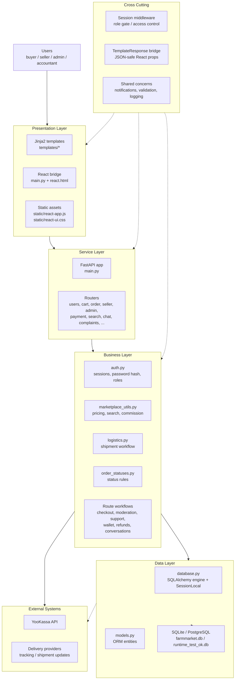

# Диаграмма архитектуры проекта

Ниже схема в стиле исходного примера, но уже под ваш проект. Я сделал её честной: с теми слоями, которые реально видны в коде `main.py`, `routes/`, `models.py`, `database.py` и вспомогательных модулях.

## Краткая расшифровка

- `Presentation Layer` отвечает за шаблоны, React-обвязку и статику.
- `Service Layer` - это `FastAPI` и маршруты в `routes/`.
- `Business Layer` содержит прикладные сценарии и общие правила домена.
- `Data Layer` - ORM-модели и подключение к БД.
- `Cross Cutting` - авторизация, доступы и общие механики, которые проходят через несколько слоёв.
- `External Systems` - реальные внешние интеграции, которые уже видны в коде.

