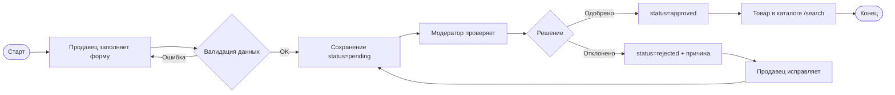

# ДИПЛОМНЫЙ ПРОЕКТ

**Тема:** Разработка модуля управления каталогом продукции в составе информационной системы фермерского маркетплейса «Свои Ряды»

**Направление:** Разработка программного продукта (модуля информационной системы)

---

## СОДЕРЖАНИЕ

Введение  
1. Анализ предметной области  
 1.1 Описание предметной области и ключевых процессов  
 1.2 Формализация бизнес-процессов  
 1.3 Обзор существующих программных продуктов  
 1.4 Обоснование необходимости разработки. Постановка задачи автоматизации  
 1.5 Выводы и выбор направления разработки  
2. Проектирование и реализация модуля программного продукта  
 2.1 Предпроектное исследование  
 2.2 Разработка технического задания  
 2.3 Архитектурное проектирование  
 2.4 Реализация проекта  
 2.5 Тестирование  
 2.6 Выводы по проектированию и реализации  
3. Технико-экономическое обоснование разработки  
 3.1 Расчёт затрат на разработку  
 3.2 Расчёт показателей экономической эффективности  
 3.3 Выводы и обоснование целесообразности внедрения  
Заключение  
Список использованных источников  
Приложения  

---

## ВВЕДЕНИЕ

### Актуальность темы

Рынок локальных и фермерских продуктов в Российской Федерации демонстрирует устойчивый рост: покупатели всё чаще выбирают прозрачные каналы сбыта с указанием происхождения, сертификации и актуальных остатков. Для продавцов (фермерских хозяйств, кооперативов, малых производителей) ключевым становится не только присутствие в сети Интернет, но и **качество цифрового каталога**: полнота карточек товара, корректные цены и единицы измерения, своевременное обновление остатков, согласованность данных с модерацией площадки.

При ручном ведении каталога в таблицах, мессенджерах или на витринах социальных сетей возникают типичные проблемы: дублирование позиций, устаревшие цены, отсутствие единой классификации, сложность поиска для покупателя, задержки публикации после изменений. В составе маркетплейса эти риски усиливаются, поскольку каталог связан с корзиной, заказами, оплатой и логистикой: ошибка в остатке или статусе товара напрямую влияет на отмены заказов и репутацию площадки.

Разработка специализированного **модуля управления каталогом продукции** в рамках информационной системы фермерского маркетплейса позволяет централизовать жизненный цикл товарных позиций — от создания продавцом до модерации и публичного отображения — и обеспечить согласованность данных для смежных модулей (поиск, корзина, заказы).

### Цель и задачи дипломного проекта

**Цель:** разработать и внедрить программный модуль управления каталогом продукции в составе веб-приложения фермерского маркетплейса «Свои Ряды», обеспечивающий полный цикл учёта товарных позиций для продавцов, покупателей и администраторов площадки.

**Задачи:**

1. Проанализировать предметную область торговли фермерской продукцией через онлайн-площадку и выявить информационные потребности участников в части каталога.
2. Смоделировать ключевые бизнес-процессы ведения и публикации товарных позиций.
3. Провести сравнительный анализ существующих программных решений для электронной коммерции и обосновать разработку собственного модуля.
4. Сформировать функциональные и нефункциональные требования, разработать техническое задание на модуль каталога.
5. Спроектировать архитектуру модуля, модель данных и пользовательские сценарии.
6. Реализовать модуль на выбранном стеке технологий (серверная часть, база данных, клиентский интерфейс).
7. Провести тестирование модуля и оценить соответствие требованиям.
8. Выполнить технико-экономическое обоснование разработки и внедрения.

Для решения поставленной задачи необходимо выполнить этапы: анализ предметной области → формализация процессов → обзор аналогов → постановка требований → проектирование → реализация → тестирование → экономическое обоснование.

### Объект и предмет исследования

| Понятие | Формулировка |
|--------|--------------|
| **Объект исследования** | Информационная система фермерского маркетплейса, обеспечивающая взаимодействие покупателей, продавцов (фермеров) и администрации площадки в процессе онлайн-торговли сельхозпродукцией и сопутствующими товарами. |
| **Предмет исследования** | Процесс управления каталогом продукции на маркетплейсе, включающий создание и редактирование карточек товара, классификацию, учёт остатков и цен, модерацию публикации, фильтрацию и отображение каталога покупателю, интеграцию с поиском и смежными модулями (корзина, заказ). |
| **Ожидаемый результат** | Программный модуль управления каталогом, реализованный в составе веб-приложения на стеке Python (FastAPI), SQLAlchemy, СУБД PostgreSQL/SQLite, клиентский интерфейс на React (встроенный SPA-мост) и Jinja2-шаблоны. |

### Методы исследования

- **Анализ предметной области** — изучение процессов продажи фермерской продукции, ролей участников, документооборота и требований к достоверности товарных данных.
- **Сравнительный анализ** готовых платформ электронной коммерции и маркетплейсов (функциональность каталога, технологии, стоимость, ограничения).
- **Моделирование бизнес-процессов** в нотациях BPMN и IDEF0.
- **Системный анализ и проектирование** — декомпозиция на модули, ER-моделирование, проектирование интерфейсов.
- **Объектно-ориентированная разработка** и итеративная реализация с использованием системы контроля версий Git.
- **Тестирование программного обеспечения** — модульное, интеграционное, системное (smoke-тесты, сценарии приёмки).
- **Экономическое моделирование** — расчёт трудозатрат, затрат на внедрение, показателей окупаемости и NPV.

### Практическая значимость работы

Разработанный модуль полезен:

- **Продавцам (фермерам)** — для самостоятельного ведения актуального ассортимента без привлечения разработчиков: добавление позиций, галереи изображений, скидок, остатков, повторная отправка на модерацию после правок.
- **Покупателям** — для быстрого поиска и фильтрации сертифицированной продукции по категориям, цене, наличию, рейтингу.
- **Администрации площадки** — для контроля качества каталога (модерация, отклонение с указанием причины, управление всем ассортиментом).
- **Организации-владельцу маркетплейса** — как основа масштабируемой ИС с единой моделью данных для заказов, аналитики и отчётности.

Модуль снижает долю ручных согласований, уменьшает количество ошибок при оформлении заказов из-за неактуальных остатков и повышает доверие к площадке за счёт прозрачных карточек товара.

### Структура пояснительной записки

Пояснительная записка состоит из введения, двух глав, раздела технико-экономического обоснования, заключения, списка источников и приложений. **Глава 1** посвящена анализу предметной области. **Глава 2** — проектированию и реализации модуля каталога. **Раздел 3** содержит расчёт экономической эффективности. **Приложения** включают фрагменты ТЗ, ER- и архитектурные схемы, таблицы тестирования, скриншоты интерфейса и листинги ключевого кода.

---

## 1. АНАЛИЗ ПРЕДМЕТНОЙ ОБЛАСТИ

### 1.1 Описание предметной области и ключевых процессов

**Предметная область** — розничная и мелкооптовая продажа фермерской и локальной продукции через интернет-маркетплейс с привлечением множества независимых поставщиков (фермеров).

**Участники:**

| Роль | Функции в части каталога |
|------|--------------------------|
| Покупатель | Просмотр каталога, фильтры, карточка товара, сравнение цен, добавление в корзину |
| Продавец (фермер) | CRUD карточек, загрузка фото, указание категории, остатков, региона, скидки |
| Модератор/администратор | Одобрение/отклонение позиций, правка ассортимента, контроль сертификации |
| Площадка (система) | Единая классификация, статусы публикации, связь с поиском и заказами |

**Ключевые процессы:**

1. **Формирование ассортимента продавцом** — ввод наименования, цены, категории (Овощи, Фрукты, Молоко, Мясо и др.), единицы измерения (кг/шт), описания, галереи.
2. **Модерация** — проверка карточки, перевод в статусы `pending` → `approved` / `rejected`.
3. **Публикация в витрине** — отображение только одобренных товаров от подтверждённых продавцов на `/catalog` и главной странице (полки «Новинки», «Зелёные ценники» и т.д.).
4. **Актуализация остатков** — уменьшение при заказе, возврат при исключении позиции из заказа продавцом.
5. **Поиск и навигация** — полнотекстовый поиск, синонимы, исправление опечаток, фильтры по цене и наличию.

**Проблемы и узкие места при отсутствии автоматизации:**

- Расхождение цены/остатка между каталогом и фактическим наличием.
- Длительный цикл согласования публикации по переписке.
- Отсутствие единой номенклатуры и дубли карточек.
- Сложность массового обновления сезонного ассортимента.
- Невозможность быстрой аналитики (популярные категории, товары со скидкой).

**Информационные потребности пользователей:**

- Продавец: быстрый ввод карточки, статус модерации, причина отклонения, фильтр «на модерации / одобрено / отклонено».
- Покупатель: фото, цена со скидкой, рейтинг товара и продавца, признак наличия, регион происхождения.
- Администратор: очередь модерации, массовый обзор каталога, удаление некорректных позиций.

### 1.2 Формализация бизнес-процессов

#### IDEF0 (контекстная диаграмма A-0)

**Название:** «Обеспечить актуальный каталог продукции на маркетплейсе»

| Элемент | Описание |
|---------|----------|
| Входы | Данные о товаре от продавца, правила площадки, медиафайлы |
| Управление | Регламент модерации, классификатор категорий, требования к сертификации |
| Механизмы | ИС «Свои Ряды», продавец, модератор |
| Выходы | Опубликованный каталог, статусы карточек, уведомления |

Декомпозиция A0:

- **A1** — Приём и валидация карточки товара (продавец).
- **A2** — Модерация и принятие решения о публикации (администратор).
- **A3** — Индексация и отображение в публичном каталоге (система).
- **A4** — Синхронизация остатков при операциях заказа (система + продавец).

#### BPMN (основной поток «Публикация товара»)



**Сценарий изменения одобрённого товара:** при редактировании продавцом карточка снова переводится в `pending`, что исключает показ непроверенных изменений покупателю.

### 1.3 Обзор существующих программных продуктов

| Критерий | **1С-Битрикс** | **OpenCart** | **WooCommerce** | **Яндекс Маркет (кабинет)** | **Разрабатываемый модуль «Свои Ряды»** |
|----------|----------------|--------------|-----------------|----------------------------|----------------------------------------|
| Функции каталога | Полный e-commerce, торговые предложения | Каталог, атрибуты, опции | Каталог в экосистеме WordPress | Загрузка фидов, модерация маркетплейса | CRUD, модерация, фильтры, поиск, галерея, остатки |
| Технологии | PHP, MySQL | PHP, MySQL | PHP, MySQL | Облачный сервис | Python FastAPI, SQLAlchemy, PostgreSQL/SQLite, React |
| Интерфейс | Админка + шаблоны | Темы оформления | Темы WP | Веб-кабинет | Единый React-интерфейс маркетплейса |
| Лицензия/стоимость | От ~40 000 ₽/год + внедрение | Open Source | Бесплатно + хостинг/плагины | Комиссия с продаж | Собственная разработка, без лицензий CMS |
| Плюсы | Зрелая экосистема | Простота, много модулей | Гибкость | Охват аудитории | Учёт специфики фермеров, модерация, единая ИС с заказами |
| Минусы | Избыточность для нишевого MVP | Слабая модерация «из коробки» | Зависимость от WP, безопасность | Нет контроля над UX и данными | Требует сопровождения разработчиком |

**Вывод по обзору:** универсальные CMS и маркетплейсы либо избыточны и дороги для нишевого фермерского проекта, либо не покрывают связку «модерация + мультипродавец + остатки в едином контуре с заказами площадки».

### 1.4 Обоснование необходимости разработки. Постановка задачи автоматизации

Существующие решения не удовлетворяют совокупности требований:

1. Обязательная **модерация** карточек независимых фермеров.
2. **Категоризация** с правилами единиц измерения (весовые категории — только «кг»).
3. Интеграция каталога с **корзиной, заказами, отзывами и поиском** в одной кодовой базе.
4. Отображение только **сертифицированной** продукции (`has_certificate`).
5. Гибкая **витрина** (новинки, акции, популярность по продажам).

**Постановка задачи автоматизации:** создать модуль управления каталогом в составе ИС фермерского маркетплейса, автоматизирующий ввод, согласование, публикацию и сопровождение товарных позиций.

**Требования к программному продукту (фрагмент):**

| ID | Требование |
|----|------------|
| FR-01 | Продавец создаёт карточку товара с обязательными полями: название, цена, категория, остаток |
| FR-02 | Поддержка скидочной цены, галереи изображений, описания, региона, сорта, срока годности |
| FR-03 | Новая/изменённая карточка продавца получает статус `pending` |
| FR-04 | Администратор одобряет или отклоняет с указанием причины |
| FR-05 | Публичный каталог показывает только `approved` товары подтверждённых продавцов |
| FR-06 | Фильтрация по категории, цене, наличию; сортировка по цене, рейтингу, новизне, популярности |
| FR-07 | Поиск с подсказками и исправлением опечаток |
| FR-08 | Карточка товара с похожими позициями и отзывами |
| NFR-01 | Время отклика страницы каталога ≤ 2 с при до 10 000 SKU (целевой показатель) |
| NFR-02 | Разграничение доступа по ролям (seller, admin, manager, user) |
| NFR-03 | Хранение паролей в виде bcrypt-хеша |
| NFR-04 | Адаптивный интерфейс (mobile-first) |

### 1.5 Выводы и выбор направления разработки

По результатам анализа выбрано направление: **веб-модуль каталога** как часть монолитного приложения FastAPI с слоистой архитектурой (presentation — service — business — data) и единой реляционной БД. Каталог тесно интегрирован с модулями пользователей, заказов и поиска, но выделен в отдельную предметную область дипломного проекта — управление номенклатурой и её публикацией.

---

## 2. ПРОЕКТИРОВАНИЕ И РЕАЛИЗАЦИЯ МОДУЛЯ ПРОГРАММНОГО ПРОДУКТА

### 2.1 Предпроектное исследование

#### Функциональные требования (детализация)

| Модуль | Функции |
|--------|---------|
| Кабинет продавца | Добавление, редактирование, удаление товара; фильтры по статусу; загрузка нескольких изображений |
| Модерация | Список `pending`; approve/reject; уведомление продавца |
| Публичный каталог | `/catalog` — пагинация 24 позиции, фильтры, спецкатегории new/sale/popular |
| Карточка товара | `/product/{id}` — галерея, похожие товары, отзывы |
| Поиск | `/search`, API подсказок `/api/search/suggestions` |
| Админ-управление | Вкладка «Товары» в `/admin/manage` |

#### Нефункциональные требования

- **Производительность:** индексы на `products.id`, `products.owner_id`, `products.status`; пагинация.
- **Надёжность:** транзакции SQLAlchemy при сохранении карточки и галереи; каскадное удаление `product_images`.
- **Безопасность:** сессии, `check_role`, скрытие неодобренных карточек от посторонних.
- **Сопровождаемость:** выделение `marketplace_utils.py` (цена, единицы, поиск), `routes/seller.py`, `main.py` (каталог).

### 2.2 Разработка технического задания

**Наименование:** Модуль управления каталогом продукции ИС «Свои Ряды».

**Технологический стек:**

| Компонент | Технология |
|-----------|------------|
| Язык | Python 3.11+ |
| Фреймворк | FastAPI 0.110 |
| ORM | SQLAlchemy 2.x |
| СУБД | PostgreSQL (продакшен), SQLite (разработка/демо) |
| Шаблоны | Jinja2 |
| Клиент | React 18 (bundled в `static/react-app.js`) |
| Аутентификация | Сессии, bcrypt |
| Тестирование | pytest, httpx TestClient |
| СКВ | Git |
| СУБД-миграции | Создание таблиц через `Base.metadata.create_all` при старте |

**Среда разработки:** VS Code / Cursor, uvicorn, виртуальное окружение Python.

### 2.3 Архитектурное проектирование

#### Выбор архитектуры

Применена **многослойная клиент-серверная архитектура** с **монолитным** развёртыванием: единое приложение FastAPI, маршруты в пакете `routes/`, общая БД. Для дипломного MVP микросервисы нецелесообразны; модуль каталога — логически выделенный домен внутри монолита.

Схема слоёв (см. также `ARCHITECTURE_DIAGRAM.md`):

- Presentation: `templates/`, `static/react-app.js`, `static/react-ui.css`
- Service: `main.py`, роутеры
- Business: `marketplace_utils.py`, валидация в `routes/seller.py`
- Data: `models.py`, `database.py`

#### Декомпозиция модулей ИС (фрагмент)

| Модуль | Ответственность |
|--------|-----------------|
| **Каталог (данный проект)** | Product, ProductImage, catalog, seller product CRUD, moderation |
| Пользователи | Регистрация, роли, профиль фермера |
| Корзина/заказы | CartItem, Order, остатки |
| Платежи | YooKassa |
| Коммуникации | Чаты, отзывы, жалобы |

#### Концептуальная модель данных (ER, фрагмент каталога)

**Сущности:**

- `users` (1) — (N) `products`
- `products` (1) — (N) `product_images`
- `products` (1) — (N) `reviews`
- `products` (1) — (N) `cart_items` / `order_items`

**Ключевые атрибуты `products`:** id, name, price, discount_price, owner_id, category, variety, weight_per_unit, expiration_days, region, stock, unit, low_stock_threshold, image_url, description, status, rejection_reason, has_certificate.

#### Логическая и физическая схема БД

Логическая модель соответствует ORM-классам `Product` и `ProductImage` в `models.py`. Физическая реализация — таблицы `products`, `product_images` с внешними ключами `ON DELETE CASCADE` для изображений и `SET NULL` для `owner_id` при удалении пользователя.

#### Интерфейсы между модулями

| Интерфейс | Описание |
|-----------|----------|
| Каталог → Корзина | `product_id`, проверка `status == approved`, `stock > 0` |
| Заказы → Каталог | Уменьшение/возврат `stock` при оформлении и исключении позиции |
| Каталог → Поиск | Чтение одобренных `Product.name`, категорий |
| Админ → Каталог | HTTP POST approve/reject/delete |

#### Проектирование пользовательского интерфейса

**Экраны модуля:**

1. Публичный каталог — сетка карточек, боковая/верхняя панель фильтров.
2. Карточка товара — фото, цена, кнопка «В корзину», блок похожих товаров.
3. Кабинет продавца — вкладки «Товары», «Добавить», фильтр по статусу.
4. Редактирование товара — форма с полями и мультизагрузкой фото.
5. Модерация — список ожидающих с кнопками «Одобрить» / «Отклонить».

**Сценарий «Добавление товара»:** Продавец → форма → валидация → `POST /seller/product/add` → `pending` → модератор → `approved` → товар на `/catalog`.

#### Проектирование безопасности

- **Аутентификация:** login, сессионная cookie.
- **Авторизация:** `check_role` для маршрутов продавца и админа; проверка `owner_id` при редактировании.
- **Конфиденциальность:** неодобренные карточки доступны только владельцу и admin/manager.
- **Целостность:** серверная валидация `_clean_product_payload` (длина полей, цена > 0, скидка < цена).

### 2.4 Реализация проекта

#### Настройка среды

```bash
pip install -r requirements.txt
# DATABASE_URL=sqlite:///./runtime_test_ok.db
uvicorn main:app --host 127.0.0.1 --port 8000
```

Демонстрационное наполнение каталога: `seed_demo_catalog.py`.

#### Реализация базы данных

Таблицы создаются при инициализации приложения. Модель `Product` содержит поля категории и модерации; `ProductImage` — упорядоченная галерея (`sort_order`).

#### Реализация бизнес-логики и API

**Создание товара (продавец):** маршрут `POST /seller/product/add` — валидация, нормализация единицы измерения `normalize_product_unit`, сохранение галереи `_sync_product_gallery`, статус `pending` (для admin — сразу `approved`).

**Редактирование:** при изменении продавцом статус сбрасывается в `pending`.

**Публичный каталог:** `GET /catalog` в `main.py` — join с рейтингами и популярностью, фильтры, сортировки `price_asc`, `rating`, `newest`, `popular` и др.

**Модерация:** `routes/admin.py` — `admin_approve_product`, `admin_reject_product`.

**Утилиты:** `effective_product_price`, `product_stock_quantity`, правила акций и категорий в `marketplace_utils.py`.

#### Пользовательский интерфейс

Клиентская логика категорий и единиц измерения в `static/react-app.js` (`PRODUCT_CATEGORIES`, `isBulkProductCategory`). Стили — `static/react-ui.css`.

#### Интеграция

Модуль каталога интегрирован с корзиной (`routes/cart.py` — проверка товара), главной страницей (товарные полки), поиском (`routes/search.py`).

### 2.5 Тестирование

#### План тестирования

| Вид | Цель |
|-----|------|
| Модульное | Функции цены, единиц, валидации payload |
| Интеграционное | CRUD товара + отображение в каталоге после approve |
| Системное | Сквозной сценарий продавец → модератор → покупатель |
| Приёмочное | Соответствие FR-01–FR-08 |

#### Тестовые сценарии (модуль каталога)

| № | Сценарий | Действие | Ожидаемый результат |
|---|----------|----------|---------------------|
| TC-C01 | Добавление товара продавцом | POST `/seller/product/add` | Запись в `products`, status=`pending` |
| TC-C02 | Одобрение модератором | POST approve | status=`approved`, товар виден в `/catalog` |
| TC-C03 | Отклонение | POST reject с причиной | status=`rejected`, причина сохранена |
| TC-C04 | Редактирование одобренного | POST edit | status снова `pending` |
| TC-C05 | Фильтр «в наличии» | GET `/catalog?in_stock=1` | Только `stock > 0` |
| TC-C06 | Сортировка по цене | `sort=price_asc` | Возрастание эффективной цены |
| TC-C07 | Доступ к неодобренному | GET `/product/{id}` чужим пользователем | Редирект на главную |
| TC-C08 | Поиск | GET `/search?q=яблоки` | HTTP 200, выдача результатов |
| TC-C09 | Удаление | POST delete | Запись удалена из БД |
| TC-C10 | Smoke публичных страниц | GET `/catalog` | HTTP 200 (`tests/test_smoke.py`) |

#### Проведение тестирования

Автоматизированные smoke-тесты в `tests/test_smoke.py` проверяют доступность `/catalog`, регистрацию, вход по ролям. Ручные проверки по `PROJECT_MEMORY.md` подтвердили цепочку: добавление товара → модерация → отображение в каталоге и поиске.

**Пример дефекта и устранения (каталог/заказы):** при исключении товара из заказа остаток на складе не восстанавливался — исправлено в `order_item_exclusion.py` с пересчётом `product.stock`.

**Повторное тестирование:** после исправлений smoke-тесты проходят успешно.

### 2.6 Выводы по проектированию и реализации

| Критерий | Оценка |
|----------|--------|
| Соответствие ТЗ | Реализованы FR-01–FR-08, основные NFR |
| Тестирование | Smoke + сценарии TC-C01–TC-C10 — выполнены |
| Качество | Код структурирован по слоям; доменные правила вынесены в утилиты |

**Ограничения:** отсутствует отдельный REST API только для каталога (используются server-side routes); массовый импорт из Excel не реализован (перспектива развития).

---

## 3. ТЕХНИКО-ЭКОНОМИЧЕСКОЕ ОБОСНОВАНИЕ РАЗРАБОТКИ

### 3.1 Расчёт затрат на разработку

**Исходные допущения:** разработка модуля каталога в составе маркетплейса силами 1 разработчика (студент + руководитель консультации); ставка условная для расчёта — **800 ₽/чел.-ч**; срок разработки модуля — **3,5 месяца** (≈ 280 чел.-ч с учётом анализа, проектирования, реализации и тестирования).

#### Календарный план (укрупнённо)

| Этап | Длительность | Трудозатраты, ч |
|------|--------------|-----------------|
| Анализ и ТЗ | 3 нед. | 60 |
| Проектирование (ER, UI) | 2 нед. | 40 |
| Реализация БД и backend | 5 нед. | 100 |
| UI каталога и кабинет продавца | 4 нед. | 60 |
| Тестирование и исправления | 2 нед. | 20 |
| **Итого** | **≈ 16 нед.** | **280** |

#### Трудозатраты и прямые затраты

| Статья | Расчёт | Сумма, ₽ |
|--------|--------|----------|
| Трудозатраты разработки | 280 ч × 800 ₽ | 224 000 |
| Оборудование (амортизация ПК, 10% от 80 000 ₽) | — | 8 000 |
| ПО (хостинг/VPS 6 мес. × 500 ₽) | — | 3 000 |
| Прочее (домен, сертификат) | — | 2 000 |
| **Итого капитальные/разовые затраты (K)** | | **237 000** |

#### Эксплуатационные затраты (годовые)

| Статья | Сумма, ₽/год |
|--------|--------------|
| VPS-хостинг | 6 000 |
| Сопровождение (20 ч × 800 ₽) | 16 000 |
| Резервное копирование | 1 200 |
| **Итого (C год)** | **23 200** |

#### Экономический эффект (годовой)

Для пилотной площадки с **15 фермерами** и **200 активными покупателями** в месяц:

| Эффект | База «до» (ручной каталог) | «После» | Экономия |
|--------|---------------------------|---------|----------|
| Время продавца на обновление 1 позиции | 25 мин | 5 мин | 20 мин |
| Позиций в месяц на продавца | 8 | 8 | — |
| Экономия времени 15 продавцов | — | 15×8×20 мин = 40 ч/мес | **480 ч/год** |
| Стоимость часа продавца | 350 ₽ | | |
| **Экономия на труде продавцов (E1)** | | | **168 000 ₽/год** |
| Снижение отмен из-за неверного остатка (2% заказов, 500 заказов/год, средний чек 1 500 ₽, потеря маржи 10%) | | | **E2 ≈ 15 000 ₽/год** |
| **Итого годовой эффект (E)** | | | **≈ 183 000 ₽/год** |

#### Риски

| Риск | Вероятность | Митигация |
|------|-------------|-----------|
| Низкая дисциплина обновления остатков | Средняя | Уведомления о низком остатке, обучение продавцов |
| Ошибки модерации | Низкая | Чек-лист модератора, причина отклонения |
| Сбой БД | Низкая | Резервное копирование, SQLite fallback в dev |

### 3.2 Расчёт показателей экономической эффективности

**Годовой чистый денежный поток (год 1):**  
`CF1 = E - C_год = 183 000 - 23 200 = 159 800 ₽`

**Срок окупаемости простой:**  
`T_ок = K / (E - C_год) = 237 000 / 159 800 ≈ 1,48 года` (**≈ 18 месяцев**).

**NPV за 3 года** при ставке дисконтирования **r = 12%**:

| Год | Денежный поток | Коэффициент дисконтирования | PV |
|-----|----------------|------------------------------|-----|
| 0 | -237 000 | 1,000 | -237 000 |
| 1 | 159 800 | 0,893 | 142 651 |
| 2 | 167 790* | 0,797 | 133 729 |
| 3 | 176 180* | 0,712 | 125 440 |

\*Принят рост эффекта 5% в год за счёт роста числа продавцов.

`NPV = -237 000 + 142 651 + 133 729 + 125 440 = **164 820 ₽** > 0` — проект экономически целесообразен.

**IRR (приближённо):** ставка, при которой NPV=0, лежит в диапазоне **22–28%** годовых, что выше 12%, проект допустим.

### 3.3 Выводы и обоснование целесообразности внедрения

Разработка модуля управления каталогом **целесообразна**: срок окупаемости менее 2 лет, положительный NPV за горизонт 3 лет, снижение трудозатрат продавцов и числа ошибочных заказов. Для образовательной организации и пилотного маркетплейса «Свои Ряды» внедрение даёт измеримый эффект при умеренных капитальных затратах.

---

## ЗАКЛЮЧЕНИЕ

В ходе выполнения дипломного проекта проведён анализ предметной области фермерского маркетплейса, смоделированы процессы публикации товарных позиций, выполнен обзор аналогов и обоснована разработка собственного модуля управления каталогом.

**Цель достигнута:** реализован программный модуль, обеспечивающий создание, модерацию, публикацию и сопровождение товарных позиций в ИС «Свои Ряды» на стеке FastAPI + SQLAlchemy + React.

**Решены задачи:** от анализа до тестирования и технико-экономического обоснования. Модуль интегрирован с корзиной, заказами и поиском; автоматизированы сценарии продавца и администратора.

**Практическая значимость** подтверждена возможностью демонстрации и пилотного внедрения для локальных производителей.

**Перспективы развития:**

- импорт/экспорт каталога (CSV, YML);
- версионирование карточек и история изменений;
- расширенная аналитика (ABC/XYZ по категориям);
- выделение Catalog API для мобильного приложения;
- полнотекстовый поиск на PostgreSQL FTS.

---

## СПИСОК ИСПОЛЬЗОВАННЫХ ИСТОЧНИКОВ

1. ГОСТ 34.602-89. Техническое задание на создание автоматизированной системы.
2. ГОСТ Р ИСО/МЭК 12207-2010. Процессы жизненного цикла программных средств.
3. Фаулер М. Архитектура корпоративных программных приложений. — М.: Вильямс, 2019.
4. Sommerville I. Software Engineering. — 10th ed. — Pearson, 2016.
5. Документация FastAPI [Электронный ресурс]. — URL: https://fastapi.tiangolo.com/ (дата обращения: 31.05.2026).
6. Документация SQLAlchemy 2.0 [Электронный ресурс]. — URL: https://docs.sqlalchemy.org/ (дата обращения: 31.05.2026).
7. OWASP Top Ten [Электронный ресурс]. — URL: https://owasp.org/www-project-top-ten/ (дата обращения: 31.05.2026).
8. 1С-Битрикс: управление сайтом — официальный сайт [Электронный ресурс]. — URL: https://www.1c-bitrix.ru/ (дата обращения: 31.05.2026).
9. OpenCart Documentation [Электронный ресурс]. — URL: https://docs.opencart.com/ (дата обращения: 31.05.2026).
10. WooCommerce Developer Docs [Электронный ресурс]. — URL: https://woocommerce.com/documentation/ (дата обращения: 31.05.2026).
11. Буч Г., Рамбо Дж., Джекобсон А. Язык UML. Руководство пользователя. — М.: ДМК Пресс, 2020.
12. Макконнелл С. Совершенный код. — М.: Русская редакция, 2019.

---

## ПРИЛОЖЕНИЯ

**Приложение А.** Фрагмент технического задания (требования FR/NFR — см. п. 1.4, 2.1).

**Приложение Б.** Архитектурная диаграмма — файл `ARCHITECTURE_DIAGRAM.md`.

**Приложение В.** ER-диаграмма (фрагмент сущностей users, products, product_images, reviews) — `docs/figures/` (скрипты генерации SVG/PNG).

**Приложение Г.** Листинги ключевого кода:
- `models.py` — классы `Product`, `ProductImage`;
- `routes/seller.py` — `seller_add_product`, `seller_edit_product_submit`;
- `main.py` — `catalog_page`;
- `marketplace_utils.py` — `normalize_product_unit`, `effective_product_price`.

**Приложение Д.** Таблицы тестирования — см. п. 2.5; расширенные HTML-таблицы — `docs/tables-testing-for-word.html` (шаблон для Word).

**Приложение Е.** Скриншоты интерфейса: каталог `/catalog`, кабинет продавца `/seller/`, модерация `/admin/moderation`, карточка товара `/product/{id}` (подготовить при сдаче).

---

*Документ подготовлен для пояснительной записки дипломного проекта. Экспорт в Word: открыть в Pandoc или скопировать разделы в шаблон ВУЗа (Times New Roman, 14 pt, межстрочный 1,5).*
